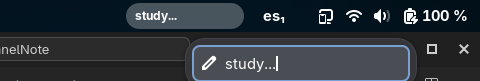

# 🎉 Panel Note Reloaded  


**Extensión resucitada para GNOME 48+** 🔧 (Fork oficial no-oficial con soporte actualizado).  

[](https://extensions.gnome.org/extension/hes36695/panel-note-reloaded/)  

> ✨ **Nota:** Este fork soluciona los errores del original en GNOME 48+ y añade mejoras de estabilidad.  


## Usage


## 🔥 Novedades  
✅ **Soporte completo para GNOME 48**  
✅ Fix definitivo para errores de "allocation"  
✅ Traducción al español disponible (¡PRs bienvenidos!)  

## 🛠 Instalación  
### **Opción 1:** Desde GNOME Extensions  
[Descarga la versión actualizada aquí](https://extensions.gnome.org/extension/XXXX/panel-note-reloaded/).  

### **Opción 2:** Manual (terminal)  
```bash
git clone https://github.com/Hes01/PanelNote-Reloaded.git
cd PanelNote